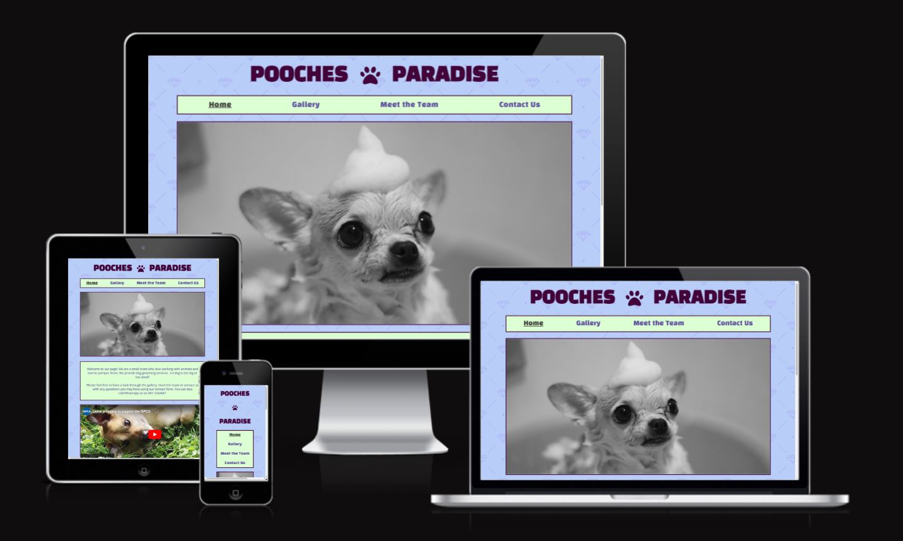

# Pooches Paradise
Code Institute - Project 1 - HTML and CSS

Pooches Paradise is a website advertising a dog-grooming business.  People who visit the website will find all they need to know about this business. Pages include a Home page with a welcome not and contact number, a gallery showcasing previous groomed dogs, a page introducing the team, and a contact page with a contact form and map showing the location.

The deployed website can be viewed here: [Pooches Paradise](https://jordanna-s.github.io/pooches-paradise/)

## UX
The user wants to: 

1. See previously groomed dogs to see quality of work
2. View location 
3. Contact the team easily

## Features
