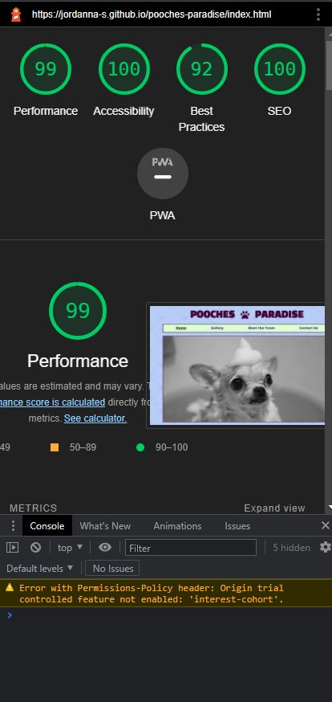

# Pooches Paradise
Code Institute - Project 1 - HTML and CSS

Pooches Paradise is a website advertising a dog-grooming business.  People who visit the website will find all they need to know about this business. Pages include a Home page with a welcome note and contact number, a gallery showcasing previous groomed dogs, a page introducing the team, and a contact page with a contact form and map showing the location.

The deployed website can be viewed here: [Pooches Paradise](https://jordanna-s.github.io/pooches-paradise/)

## UX
The user wants to: 

1. See previously groomed dogs to see quality of work
2. View location 
3. Contact the team easily
---
## Features

### Navigation

1. The navigation bar at the top of the page includes clickable headings to each page - Home, Gallery, Meet the Team and Contact Us.
2. Over the nav bar there is a heading with the name of the page and a pawprint symbol to indicate it is related to dogs.
3. The colours compliment each other and have a nice contrast.
4. The font is clear and easy to read.
5. The background pattern has diamonds in it to go with the name 'Pooches **Paradise**' to illustrate luxury. 

### Welcome Note

1. The Welcome Note on the Home Page introduces the business to the user, outlines what they do, what they can find on the website and a contact number.
2. There is also a section as they support ISPCA with a video and some information relating to that.

### Gallery

The Gallery shows a picture collage of many different dogs that have been previously groomed at the business.  This showcases the high standard of the work that they do.  The colours are nice and bright to go with our colourful theme across the website.

### Meet the Team

The Meet the Team section provides a more personable and friendly vibe.  It is a small team and is an introduction to each team member to get to know them a little better and also see how much experience they have.  It is always nice to put a face to the people you may be dealing with.

### Contact Us

The Contact Us page has a contact form which includes fields for first name, last name, email address and message.  There is also a map with the business location on the right of the page.

### Footer 

The footer contains social media links to Facebook, Instagram, Twitter and Youtube.  When clicked on, the social media site opens in a new tab.

----

## Testing

- I tested the site on different browsers and checked that all links are working (Chrome and Edge).
- I confirmed that all text is in a clear format and easy to read.
- I confirmed that the colours used complimented each other and had a good contrast.
- I confirmed the contact form is working correctly, each field is mandatory and the email address field will only accept an email address format.
- I checked responsiveness and added media queries for different screen sizes.

### Bugs

#### Solved Bugs

- There was a space showing between the bottom of the main picture on the home page and the bottom border around the image.  To resolve this I added code:

    `font-size:0; to main_image class in styles.css`
- Error: Bad value 100% for attribute width on element img: Expected a digit but saw % instead.  I removed the size attributes in the main image code in the html (home page).

- Attribute autoplay not allowed on element iframe at this point. From line 46, column 17; to line 46, column 263.  I fixed by removing this attribute.

#### Unfixed Bugs

- There is empty space showing under the footer for certain screen sizes.
- Video is outside margin on smaller screens

### Validator Testing

- HTML W3C Validator
    

- CSS W3C Validator
    

- Accessibility using Lighthouse in Dev Tools
    
------
## Deployment
The site was deployed to GitHub Pages.
1. In the GitHub Repository I clicked on the settings tab.
2. I selected Pages on the left sidebar.
3. I then selected the main branch and saved.
4. It then provided me with a link to the website.

You can visit the website here: [Pooches Paradise](https://jordanna-s.github.io/pooches-paradise/)

------
## Credits
- Video: https://www.youtube.com/watch?v=wDOntFcZg-I
- Fonts from: Google Fonts
- Background Pattern from: https://heropatterns.com/ 
- Learned ‘fade-in’ animation here: https://blog.hubspot.com/website/css-fade-in#:~:text=In%20the%20CSS%2C%20use%20the,creates%20the%20fade%2Din%20effect. 
- Resized images on: https://cloudinary.com/ 
- Got map link from Google Maps
- Images from AmIResponsive, Pexels, Unsplash and FreePik.